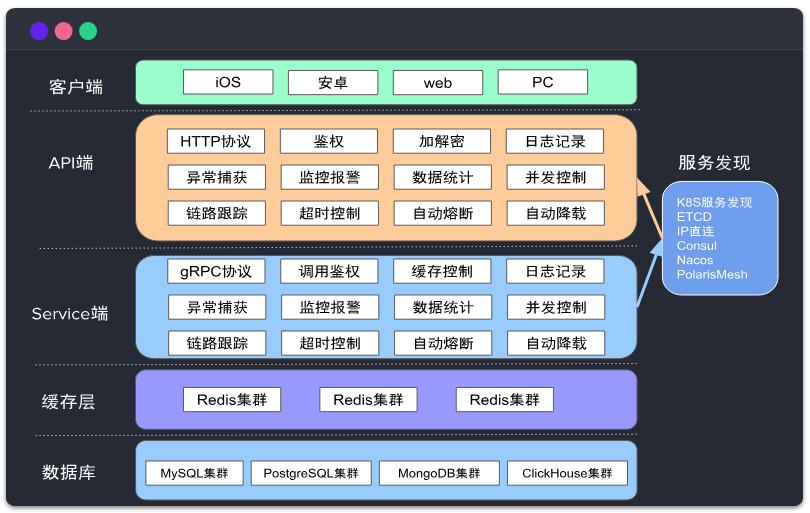
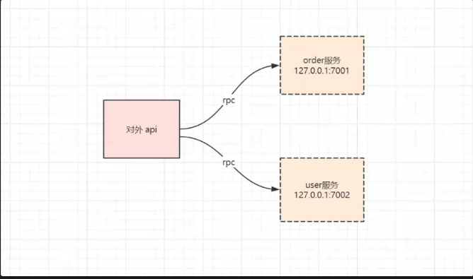
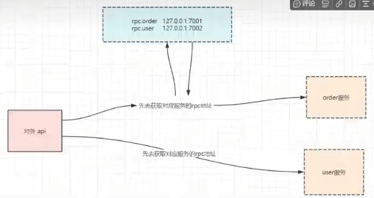

# gozerolearn

go-zero go-zero整体上做为一个稍重的微服务框架，提供了微服务框架需要具备的通用能力，同时也只带一部分的强约束，例如针对web和rpc服务需要按照其定义的DSL的协议格式进行定义，日志配置、服务配置、apm配置等都要按照框架定义的最佳实践来走。 社区建设： go-zero已经是CNCF项目，做为一个后起的微服务框架，不得不说在国内社区生态建设和维护上，完美适配国内开源的现状，在微信群、公众号、各种大会等多渠道进行推广，社区也时常有文章指导实践。

greet start: go run greet.go -f etc/greet-api.yaml

greet 验证: curl -i http://localhost:8888/from/you //此处接口是预定义接口，作为验证使用。

go-zero 是一个集成了各种工程实践的web和rpc框架，通过弹性设计保障了大并发服务器的稳定性，经受了充分的实战检验。

官网：go-zero.dev

## 架构图


# 什么是微服务？

顾名思义，其实就是微小的服务。

最早之前的业务系统都是单体项目，像之前的web项目都属于单体项目。

单体项目的弊端：例如：后端要改一个很小的地方，那么需要整个项目重新构建，然后停止整个项目然后重启项目。所以企业项目发布都选在深夜发布就是这个原因。

那么，如果是微服务呢？

可以将大系统按照功能或者是产品进行服务拆分，形成一个独立的服务。

以一个博客为例，将博客项目拆分为用户服务和文章服务，修改文章服务就只需要修改文章服务的部分，修改用户服务就改用户服务的部分

## 需要准备的工具：
1. etcd
2. mysql
3. protoc (转rpc代码 环境准备中有准备好的压缩包  解压放在go/bin目录下就行了)
4. goctl (https://zhuanlan.zhihu.com/p/624597859)

## etcd
（理解为加强版的redis 但是它只能存字符串）
Etcd 是一个高可用的分布式的kv存储系统，主要用于共享配置信息和服务发现。它采用 Raft 一致性算法来保证数据的强一致性，并且支持对数据进行监视和更新

#### 为什么要用 etcd ？
主要是用于微服务的配置中心，服务发现

至于为什么不用redis，是因为etcd的数据可靠性更强

[windows 安装](https://github.com/etcd-io/etcd/releases)

[linux 安装](blog.csdn.net)

```shell
# docker 安装

docker run --name etcd -d -p 2379:2379 -p 2380:2380 -e ALLOW_NONE_AUTHENTICATION=yes bitnami/etcd:3.3.11 etcd
```
docker 安装



在对外api这个应用里面，怎么知道 order 服务的 rpc 地址呢？

写在配置文件里的话，那么服务的 ip 地址变化后就需要应用程序重启才能解决



如果用了etcd就是这样的，先去获取后端服务的一个监听地址，然后才会发送消息到对应的rpc服务上面去

```
# etcd 基本命令

# 设置或者更新值
etcdctl put name 洲洲
# 获取值
etcdctl get name
# 只要value
etcdctl get name --print-value-only
# 获取name前缀的键值对
etcdctl get --prefix name
# 删除键值对
etcdctl del name
# 监听键的变化
etcdctl watch name

```
[etcd指令](https://www.jianshu.com/p/67cbef492812)

## 最简单的微服务demo
这个demo是一个用户微服务，一个视频微服务

视频微服务需要提供一个http接口，用户查询一个视频的信息，并且把关联用户id的用户名也查出来

那么用户微服务需要提供一个方法，需要根据用户id返回用户信息

#### 用户微服务

1. 编写rpc的proto文件
```protobuf
// user/rpc/user.proto
syntax = "proto3";

package user;

option go_package = "./user";

message IdRequest {
  string id = 1;
}

message UserResponse {
  // id
  string id = 1;
  // name
  string name = 2;
  // sex
  bool gender = 3;
}

service User {
  rpc getUser(IdRequest) returns (UserResponse);
}

// goctl rpc protoc user/rpc/user.proto --go_out=user/rpc/types --go-grpc_out=user/rpc/types --zrpc_out=user/rpc/
// 记得 这里用的是相对路径，如果在user目录下对应的路径就要记得修改
```

接口调用用的是APIfox 这个可以直接导入proto直接实现接口的自动调用   特别好用

2. 编写api
```api
type (
    VideoReq {
        Id string `path:"id"`
    }

    VideoRes {
        Id      string `json:"id"`
        Name    string `json:"name"`
    }
)

service video {
    @handler getVideo
    get /api/videos/:id (VideoReq) returns (VideoRes)
}

// goctl api go -api video/api/video.api -dir video/api/
```

3. 添加 user rpc 配置

因为要在 video 里面调用 user 的 rpc 服务

video/api/internal/config/config.go
```go
package config

import (
	"github.com/zeromicro/go-zero/rest"
	"github.com/zeromicro/go-zero/zrpc"
)

type Config struct {
	rest.RestConf
	UserRpc zrpc.RpcClientConf
}
```

4. 完善服务依赖

video/api/internal/svc/servicecontext.go
```go
package svc

import (
	"api/internal/config"
	"github.com/zeromicro/go-zero/zrpc"
	"zerostudyone/user/rpc/userclient"
)

type ServiceContext struct {
	Config config.Config
	UserRpc userclient.User
}

func NewServiceContext(c config.Config) *ServiceContext {
	return &ServiceContext{
		Config: c,
		UserRpc: userclient.NewUser(zrpc.MustNewClient(c.UserRpc)),
	}
}
```
如果遇到引用问题  可以用 go mod replace 的方法

```go
replace zerostudyone/user/rpc => E:\zhoulearn\gozerolearn\learnstart\zerostudyone\user\rpc
```

5. 添加yaml配置

video/api/etc/video.yaml

```yaml
Name: video
Host: 0.0.0.0
Port: 8888
UserRpc:
  Ercd:
    Hosts:
      - 127.0.0.1:2379
    Key: user.rpc
```

6. 完善服务依赖

video/api/internal/logic/getvideologic.go
```go
func (l *GetVideoLogic) GetVideo(req *types.VideoReq) (resp *types.VideoRes, err error) {
// todo: add your logic here and delete this line
    user1, err := l.svcCtx.UserRpc.GetUser(l.ctx, &user.IdRequest{
        Id: "1",
    })
    if err != nil {
        return nil, err
    }

    return &types.VideoRes{
        Id: req.Id,
        Name: user1.GetName(),
    }, nil
}
```

